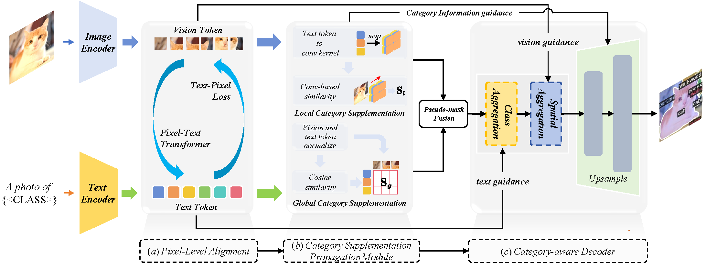

# FGA-Seg: Fine-Grained Pixel-Text Alignment for Open-Vocabulary Semantic Segmentation
This is our official implementation of FGA-Seg! 

## Introduction

Open-vocabulary segmentation aims to identify and segment specific regions and objects based on text-based descriptions. A common solution is to leverage powerful vision-language models (VLMs), such as CLIP, to bridge the gap between vision and text information. However, VLMs are typically pretrained for image-level vision-text alignment, focusing on global semantic features. In contrast, segmentation tasks require fine-grained pixel-level alignment and detailed category boundary information, which VLMs alone cannot provide. As a result, information extracted directly from VLMs can't meet the requirements of segmentation tasks.
To address this limitation, we propose FGAseg, a model designed for fine-grained pixel-text alignment and category boundary supplementation. 
The core of FGAseg is a Pixel-Level Alignment module that employs a cross-modal attention mechanism and a text-pixel alignment loss to refine the coarse-grained alignment from CLIP, achieving finer-grained pixel-text semantic alignment.
Additionally, to enrich category boundary information, we introduce the alignment matrices as optimizable pseudo-masks during forward propagation and propose Category Information Supplementation module. These pseudo-masks, derived from cosine and convolutional similarity, provide essential global and local boundary information between different categories.
By combining these two strategies, FGAseg effectively enhances pixel-level alignment and category boundary information, addressing key challenges in open-vocabulary segmentation. 
Extensive experiments demonstrate that FGAseg outperforms existing methods on open-vocabulary semantic segmentation benchmarks.

## :❗️Update:
We released the code of FGA-Seg! 

## :fire:TODO
- [x] Train/Evaluation Code (Jar 21, 2025)

## Installation
Please follow [installation](INSTALL.md). 

## Data Preparation
Please follow [dataset preperation](datasets/README.md).

## Training
We provide shell scripts for training and evaluation. ```run.sh``` trains the model in default configuration and evaluates the model after training. 

To train or evaluate the model in different environments, modify the given shell script and config files accordingly.

### Training script
```bash
sh run.sh [CONFIG] [NUM_GPUS] [OUTPUT_DIR] [OPTS]

sh run.sh configs/vitb_384_fast_add.yaml 8 output/
sh run.sh configs/vitb_384_fast_cat.yaml 8 output/
sh run.sh configs/vitb_384_no_fast_add.yaml 8 output/
#### -------------------------------------------------------
sh run.sh configs/vitb_384_no_fast_cat.yaml 8 output_nofast_dual/
#### -------------------------------------------------------
conda activate MMSFormer
#### -------------------------------------------------------


sh run.sh configs/vitl_336_fast_add.yaml 8 output/
sh run.sh configs/vitl_336_fast_cat.yaml 8 output/
### 
sh run.sh configs/vitl_336_no_fast_add.yaml 8 output/
sh run.sh configs/vitl_336_no_fast_cat.yaml 8 output/

# ----------------------------------
sh run.sh configs/vitb_384_fast_cat_p2t_2.yaml 8 output/
sh run.sh configs/vitb_384_fast_cat_p2t_4.yaml 8 output/
sh run.sh configs/vitb_384_fast_cat_p2t_6.yaml 8 output/

# ----------------------------------
sh run.sh configs/vitb_384_fast_cat_align_0.001.yaml 8 output/
sh run.sh configs/vitb_384_fast_cat_align_0.2.yaml 8 output/
sh run.sh configs/vitb_384_fast_cat_align_1.yaml 8 output/

# --------------------------------------
sh run.sh configs/vitb_384_fast_cat_kernel_1.yaml 8 output/

# frozen p2tformer
sh run.sh configs/vitb_384_fast_cat_frozen_w_P2Tformer.yaml 8 output/
sh run.sh configs/vitb_384_fast_cat_frozen_wo_P2Tformer.yaml 8 output/

```
## Evaluation
```eval.sh``` automatically evaluates the model following our evaluation protocol, with weights in the output directory if not specified.
To individually run the model in different datasets, please refer to the commands in ```eval.sh```.

### Evaluation script
```bash
sh run.sh [CONFIG] [NUM_GPUS] [OUTPUT_DIR] [OPTS]

sh eval.sh configs/vitl_336.yaml 8 output/ MODEL.WEIGHTS /data01/lby2/FGA-Seg-main/output/model_final.pth

sh eval.sh configs/vitb_384.yaml 8 output/ MODEL.WEIGHTS /data01/lby2/FGA-Seg-main/output/model_final.pth

sh eval.sh configs/vitb_384_no_fast_ablation_blank.yaml 8 output_ablation_blank/ MODEL.WEIGHTS /data01/lby2/FGA-Seg-main/output_ablation_blank/model_0044999.pth

sh eval.sh configs/vitb_384_no_fast_ablation_p2tformer.yaml 8 output_ablation_p2tformer/ MODEL.WEIGHTS /data01/lby2/FGA-Seg-main/output_ablation_p2tformer/model_0019999.pth

sh eval.sh configs/vitb_384_no_fast_ablation_former_loss.yaml 8 output_ablation_p2tformerLoss/ MODEL.WEIGHTS /data01/lby2/FGA-Seg-main/output_ablation_p2tformerLoss/model_0029999.pth
```
# topK 
```bash
sh eval.sh configs/vitb_384_fast_cat_topk_inference.yaml 8 output/ MODEL.WEIGHTS /data01/lby2/FGA-Seg-main/output_fast_cat_topk_inference/model_final.pth
```

## Pretrained Models
We provide pretrained weights for our models reported in the paper. All of the models were evaluated with 4 NVIDIA RTX 4090 GPUs, and can be reproduced with the evaluation script above.


## Acknowledgement
We would like to acknowledge the contributions of public projects, such as [CAT-seg](https://github.com/cvlab-kaist/CAT-Seg), whose code has been utilized in this repository.
We also thank [Benedikt](mailto:benedikt.blumenstiel@student.kit.edu) for finding an error in our inference code and evaluating FGA-Seg over various datasets!
## Citing FGA-Seg :

```BibTeX

```
